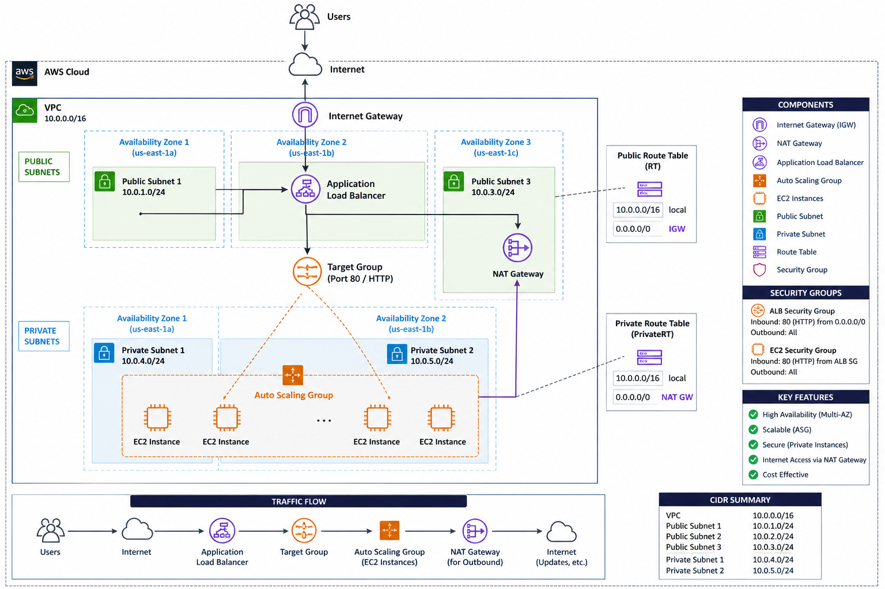

# aws-scalable-web-infrastructure-terraform
Scalable and highly available AWS infrastructure built using Terraform, featuring an Application Load Balancer, Auto Scaling Group, and secure private subnets with NAT Gateway for outbound internet access.

This project demonstrates the design and implementation of a production-like, highly available web application infrastructure on AWS using Infrastructure as Code (Terraform).

The architecture is deployed across multiple Availability Zones to ensure high availability and fault tolerance. It includes an Application Load Balancer (ALB) to distribute incoming traffic, an Auto Scaling Group (ASG) to dynamically manage EC2 instances, and private subnets to enhance security by preventing direct internet access to application servers.

A NAT Gateway is configured to allow instances in private subnets to access the internet for updates and package installations, while remaining inaccessible from external sources. Security Groups are used to strictly control inbound and outbound traffic between components.

This setup reflects real-world cloud architecture patterns used in production environments, focusing on scalability, security, and reliability

